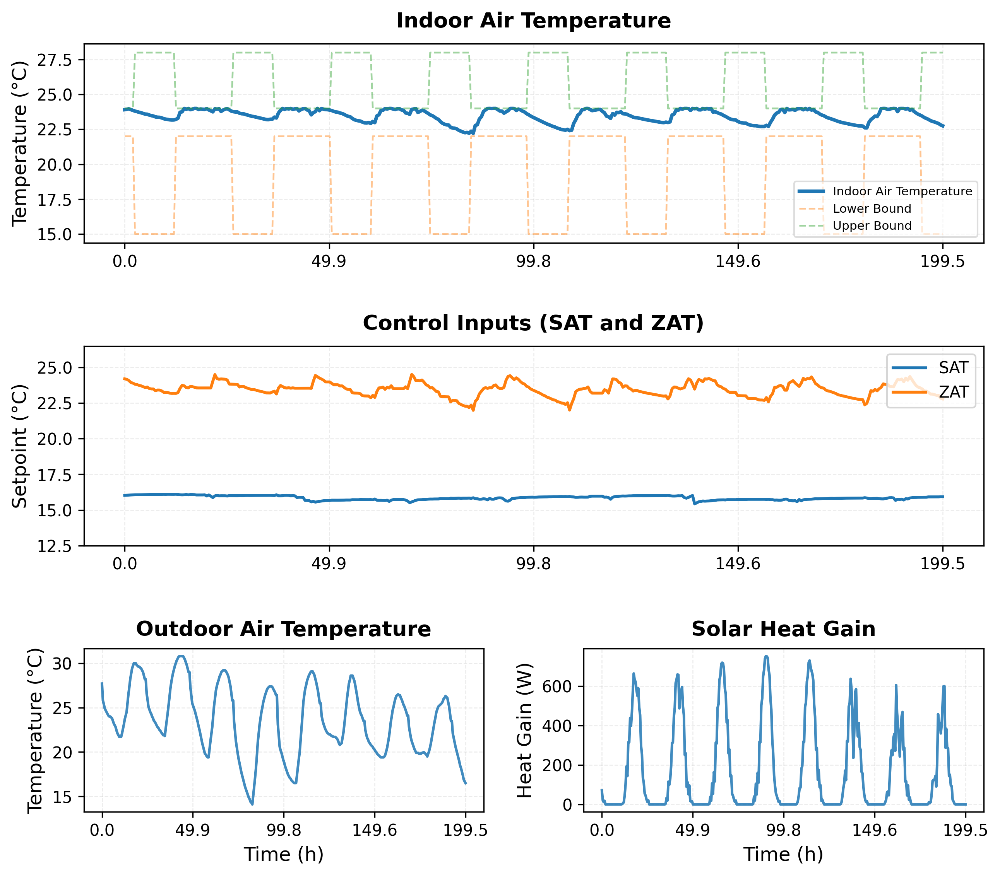
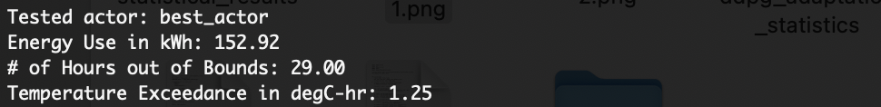

# Meta-RL for HVAC Control

This project studies meta-reinforcement learning (Meta-RL) for HVAC control.

The goal is to learn a generic policy that can generalize across multiple HVAC environments with different 3R2C parameters, and then quickly adapt to a new environment.

The framework mainly combines:

- PPO-based meta training
- DDPG-based inner-loop adaptation
- Warm-up mechanisms for stable adaptation
- Conservative policy updates
- Environment diversity analysis

---

# Pipeline

The workflow contains four main parts:

1. PPO-based meta-policy training
2. DDPG-based adaptation on new environments
3. Offline policy evaluation
4. Environment diversity experiments

---

# Meta-Policy Training

The meta-policy is trained using PPO across multiple HVAC environments.

Each environment has different:

- thermal capacitance
- thermal resistance
- outdoor interaction parameters

The PPO policy learns a generic control strategy that can transfer across environments.

To run meta training:

```bash
python3 meta-rl.py
```

The trained meta-policy will be saved in:

```text
model/best_actor
model/final_actor
model/shared_ddpg_critic
```

Main saved files include:

```text
best_actor.pth
final_actor.pth
```

---

# DDPG Adaptation

After obtaining a generic PPO policy, we use DDPG to adapt the policy to a specific environment.

The adaptation framework includes:

- shared Q initialization
- warm-up training for Q learning
- conservative policy updates
- best-model selection

To run adaptation:

```bash
python3 ddpg_update.py
```

The adapted models will be saved in:

```text
ddpg/ddpg_adapted
```

The saved checkpoint may include:

```text
best_actor
final_actor
last_best_actor
last_min_exceed_actor
```

---

# Offline Evaluation

To evaluate the trained policy:

```bash
python3 offline_test.py
```

The offline evaluation reports:

- indoor temperature regulation
- HVAC energy consumption
- temperature exceedance
- adaptation performance

The script also generates visualization figures for qualitative analysis.

## Example Evaluation Results

### Indoor Temperature and Control Performance

<p align="center">
  
</p>

The indoor temperature remains within the desired comfort bounds during both daytime and nighttime. The learned SAT and ZAT setpoints change smoothly according to the occupancy schedule, while the outdoor temperature and solar heat gain follow realistic daily patterns.

### Quantitative Evaluation

<p align="center">
  
</p>

Example evaluation metrics:

| Metric | Value |
|--------|------:|
| Energy Use | **152.92 kWh** |
| Hours Out of Bounds | **29.00 h** |
| Temperature Exceedance | **1.25 °C·hr** |

These results demonstrate that the proposed framework maintains thermal comfort while achieving energy-efficient HVAC control.

# Environment Diversity Experiments

We also study the relationship between:

- PPO training performance
- environment diversity
- convergence speed

To run diversity experiments:

```bash
python diversity.py
```

---

# Main Files

```text
meta-rl.py          PPO meta training
ddpg_update.py      DDPG adaptation
ddpg_torch.py       DDPG implementation
offline_test.py     Offline evaluation
diversity.py        Diversity experiments
Env_develop.py      HVAC environment
```

---

# Current Research Focus

Current work mainly focuses on:

- improving adaptation stability
- reducing unstable DDPG updates
- studying environment diversity
- improving meta-policy quality

---

# Repository

https://github.com/clarexiaoqi/meta_rl/tree/Yizhong's_update_2

